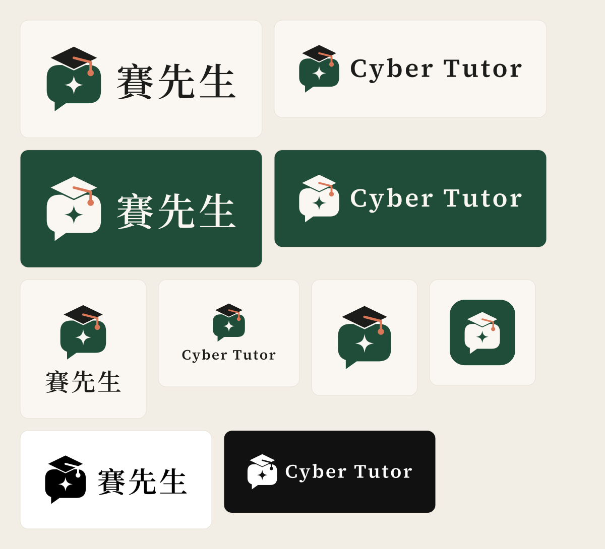

# 賽先生 Cyber Tutor logo：Mentor Bubble

AI 對話框戴著學士帽，框內是 AI 火花：「對話本身就是老師」。配色沿用官網設計系統（墨綠、墨黑、米白、陶土橘）。

官網上的 logo 由 `src/components/Logo.astro` 直接繪製，`public/favicon.svg`、`og-image.png`、`apple-touch-icon.png` 也用同一組路徑（後兩者由 `scripts/generate-images.mjs` 產生）。這個資料夾是給網站以外使用的檔案：簡報、名片、文件、社群頭像、印刷。

## 檔案

| 用途 | 檔案 |
| --- | --- |
| 橫式組合（淺色底） | `svg/lockup-horizontal-zh.svg`、`svg/lockup-horizontal-en.svg`，PNG：`png/lockup-horizontal-{zh,en}-1600.png` |
| 橫式反白（墨綠或深色底） | `svg/lockup-horizontal-{zh,en}-reversed.svg`，PNG：`png/lockup-horizontal-{zh,en}-reversed-1600-on-green.png` |
| 直式組合 | `svg/lockup-stacked-{zh,en}.svg`、`svg/lockup-stacked-{zh,en}-reversed.svg`，PNG：`png/lockup-stacked-{zh,en}-1000.png` |
| 單色（印章、雷雕、傳真、單色印刷） | `svg/lockup-horizontal-{zh,en}-black.svg`、`-white.svg`，`svg/icon-black.svg`、`svg/icon-white.svg` |
| 只有圖示 | `svg/icon.svg`、`svg/icon-reversed.svg`、`png/icon-512.png` |
| App 圖示、社群頭像 | `svg/app-icon.svg`、`png/app-icon-1024.png`、`png/app-icon-512.png` |
| favicon | `png/favicon-16.png`、`png/favicon-32.png`、`png/favicon-48.png` |

- SVG 的文字都已轉成外框（中文 Noto Serif TC、英文 Source Serif 4，字重 600，字距 0.08em，與官網 Logo 相同），沒有安裝字體也能正確顯示
- 學士帽與對話框之間的 V 形縫是對話框本身的缺口，放在任何底色上都正確
- `-reversed` 版的米白色在透明底上看不到，請放在墨綠或深色底上使用

## 顏色

| 用途 | 名稱 | HEX | 官網變數 |
| --- | --- | --- | --- |
| 對話框 | 墨綠 | `#1F4D3A` | `--primary` |
| 學士帽、文字 | 墨黑 | `#1C1C1A` | `--ink` |
| 流蘇（只用在這個小面積） | 陶土橘 | `#D97757` | `--accent` |
| 火花、反白底上的圖形與文字 | 米白 | `#FAF7F2` | `--bg`、`--on-primary` |

反白版：對話框與學士帽改米白，火花改墨綠，流蘇維持陶土橘。印刷前請印刷廠對應 Pantone 色號。

## 使用規範

- **留白**：四周至少保留「對話框高度的一半」
- **最小尺寸**：橫式組合寬 100px（印刷 25mm）；只有圖示時 16px（印刷 6mm），16px 時火花會糊成一點，32px 以上清楚
- **不要**：拉長壓扁、改顏色、加陰影或漸層、把文字換成其他字體、直接放在照片或花紋上（請改用反白版或加上底色）
